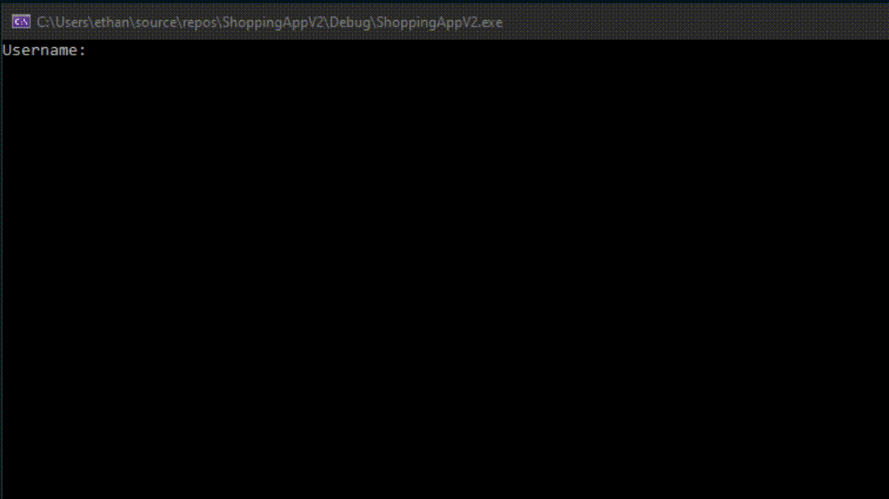
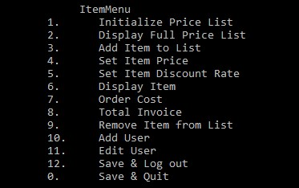
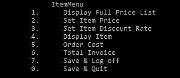

# ShoppingApp

## General Overview
Final project of 1st year for Object Oriented Programming in C++. Focuses on the instantiating of objects with array-type.

This app also incorporates a login function reading from a .txt file. These .txt files could be updated with new information
provided you were a Manager ('m') and not an Assistant ('a'). The manager and assistant were both displayed different screens
so a manager would have more functionality than an assistant.

### The Login Feature

This feature prompts the user to enter their username and password, if they match the database, they'll enter into their portal respective to their role.

     int Login(CUser userlist[], int usersize, CItem itemlist[], int itemsize)
     {
    
    string username = ""; 
    int password = 0;
    cout << "Username: "; 
    cin >> username;
    cout << endl << "Password: "; 
    cin >> password;
 
    for (int i = 0; i < usersize; i++) {
        //If the credentials match with the data, login will proceed to display either menu, depending on the userType
        if (username == userlist[i].GetUsername() && password == userlist[i].GetPassword()) {
            system("color 0A");
            cout << "Login successful!" << endl;
            Sleep(800);
            system("cls");
            system("color 07");
            if (userlist[i].GetUserType() == 'M') {
                ManagerMenu(itemlist, itemsize, userlist, usersize);
                return 0;
            }
            else{
                AssistantMenu(itemlist, itemsize, userlist, usersize);
            return 0;
            }
            
        }
        
 
    }
    system("color 0c");
    cout << "There was no match, try again.\n";
    Sleep(800);
    system("cls");
    system("color 07");
    //Reloads the login function if there wasn't a match
    Login(userlist, usersize, itemlist, itemsize);
    return 0;
    }

### Manager's Option List

      
    int ManagerMenu(CItem list[], int itemlistSize, CUser userlist[], int userlistSize)
    {
      int input = 1;
 
    
 
    while (input != 0) {
 
        cout << "\t     ItemMenu\n";
        cout << "\t1.\tInitialize Price List\n";
        cout << "\t2.\tDisplay Full Price List\n";
        cout << "\t3.\tAdd Item to List\n";
        cout << "\t4.\tSet Item Price\n";
        cout << "\t5.\tSet Item Discount Rate\n";
        cout << "\t6.\tDisplay Item\n";
        cout << "\t7.\tOrder Cost\n";
        cout << "\t8.\tTotal Invoice\n";
        cout << "\t9.\tRemove Item from List\n";
        cout << "\t10.\tAdd User\n";
        cout << "\t11.\tEdit User\n";
        cout << "\t12.\tSave & Log out\n";
        cout << "\t0.\tSave & Quit\n";
 
 
        cout << "\nChoose an option\n";
        cin >> input;
 
        switch (input) {
        case 1:
            itemlistSize = DoInitializePriceList(list, itemlistSize);
            cout << itemlistSize;
            break;
        case 2:
            DoDisplayFullPriceList(list, itemlistSize);
            break;
        case 3:
            DoAddItemToList(list, itemlistSize);
            itemlistSize++;
            break;
        case 4:
            DoSetItemPrice(list, itemlistSize);
            break;
        case 5:
            DoSetItemDiscountRate(list, itemlistSize);
            break;
        case 6:
            DoDisplayItem(list, itemlistSize);
            break;
        case 7:
            DoOrderCost(list, itemlistSize);
            break;
        case 8:
            DoTotalInvoice(list, itemlistSize);
            break;
        case 9:
            DoRemoveItemFromList(list, itemlistSize);
            itemlistSize--;
            break;
        case 10:
            DoAddUser(userlist, userlistSize);
            userlistSize++;
            break;
        case 11:
            DoEditUser(userlist, userlistSize);
            break;
        case 12:
            DoQuit(list, itemlistSize);
            WriteUserFile(userlist, userlistSize);
            system("cls");
            Login(userlist, userlistSize, list, itemlistSize);
            return 0;
            break;
        case 0:
            DoQuit(list, itemlistSize);
            WriteUserFile(userlist, userlistSize);
            break;
        default:
            break;
        }
    }
    return 0;
 
    }
### Assistant's Option List

 
    int AssistantMenu(CItem list[], int actualSize, CUser userlist[], int userlistSize)
    {
    int input = 1;
 
    
 
    while (input != 0) {
 
        cout << "\t     ItemMenu\n";
        cout << "\t1.\tDisplay Full Price List\n";
        cout << "\t2.\tSet Item Price\n";
        cout << "\t3.\tSet Item Discount Rate\n";
        cout << "\t4.\tDisplay Item\n";
        cout << "\t5.\tOrder Cost\n";
        cout << "\t6.\tTotal Invoice\n";
        cout << "\t7.\tSave & Log off\n";
        cout << "\t0.\tSave & Quit\n";
        cout << "\nChoose an option\n";
        cin >> input;
 
        switch (input) {
 
        case 1:
            DoDisplayFullPriceList(list, actualSize);
            break;
        case 2:
            DoSetItemPrice(list, actualSize);
            break;
        case 3:
            DoSetItemDiscountRate(list, actualSize);
            break;
        case 4:
            DoDisplayItem(list, actualSize);
            break;
        case 5:
            DoOrderCost(list, actualSize);
            break;
        case 6:
            DoTotalInvoice(list, actualSize);
            break;
        case 7:
            DoQuit(list, actualSize);
            system("cls");
            Login(userlist, userlistSize, list, actualSize);
            return 0;
            break;
        case 0:
            DoQuit(list, actualSize);
            break;
        default:
            break;
        }
    }
    return 0;
    }
 
## Data Used
Listing all the data from the text files that were used to give you an understanding of what we were working with.

### Object Data
| Item Code | Description | Price | Discount |
|-----------|-------------|-------|----------|
| 1	        |  Bread	    | 4.99	|  20	     |
| 2	        |  Milk	      | 4.99	|  10	     |
| 3	        |  Eggs	      | 3.99	|  20	     |
| 4	        |  Pizza	    | 6.99	|  40	     |
| 6	        |  Banana	    | 3.99	|  15	     |

### Employee Data
| Username | Password | Position | 
|----------|----------|----------|
|Tom	     |1234	    |M	       |
|Fred	     |9876	    |A	       |
|Ger	     |4321	    |A	       |

## Where can I view the source code?!
Right [Here!](sourceCode.md)
